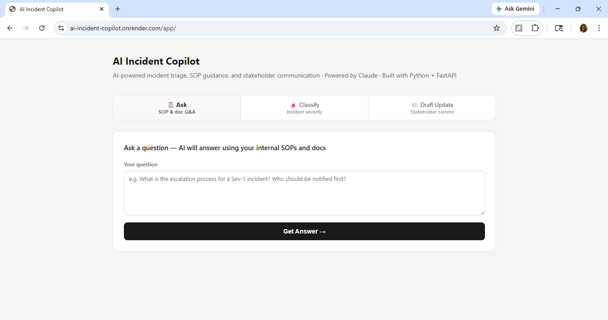
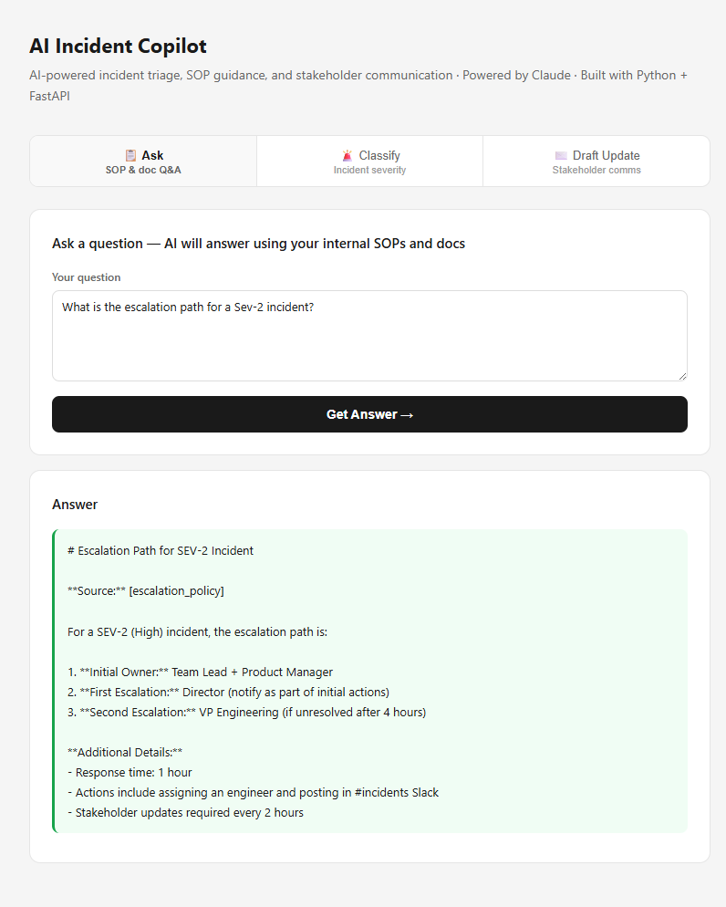
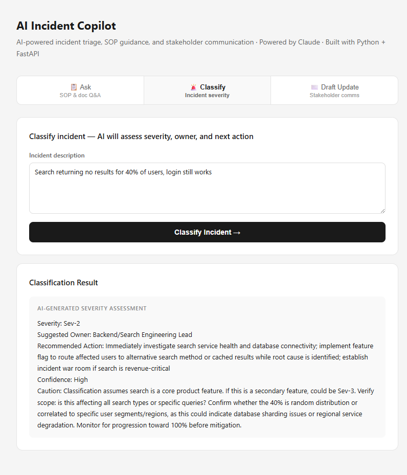
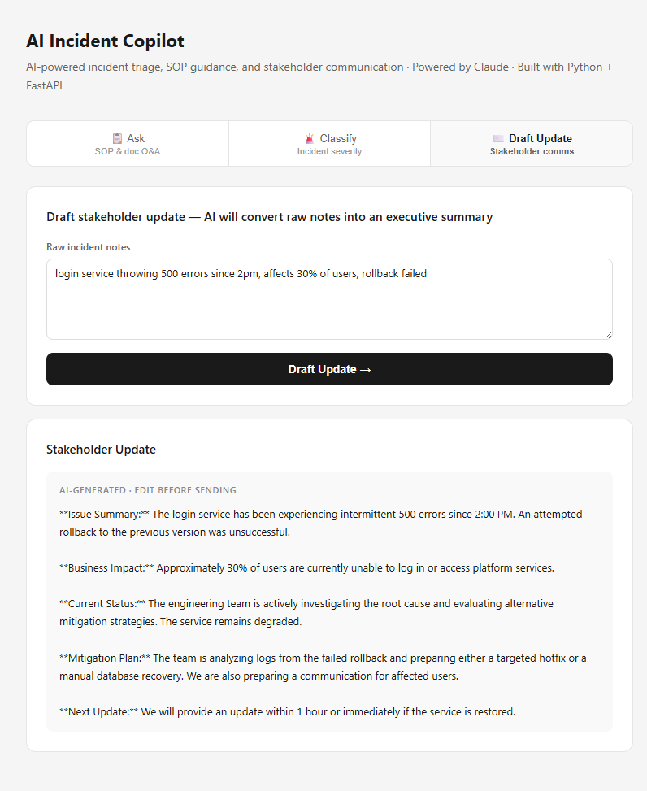

# AI Launch & Incident Copilot

AI-powered decision-support system for program, engineering, and operations teams that automates incident triage, SOP-based guidance, and stakeholder communication through structured reasoning and grounded document retrieval.

Built as an end-to-end product with a FastAPI backend, Claude-powered intelligence, and a lightweight UI for business users.

🔗 **Live Demo:** https://ai-incident-copilot.onrender.com/app/

📚 **API Docs:** https://ai-incident-copilot.onrender.com/docs

👤 **Author:** Swathi Krishna

---

## Overview

AI Launch & Incident Copilot is a business-facing AI application designed to reduce the manual overhead involved in the first phase of incident response and launch execution.

The system helps answer three critical operational questions:

- **Guidance:** What does our SOP say about this situation, and where does that guidance come from?
- **Triage:** How severe is this incident, who owns it, and what should happen next?
- **Communication:** How do I turn these raw notes into a clear update for leadership or partner teams?

The application is exposed through REST APIs, making it straightforward to integrate into internal workflows, support tools, or launch-readiness processes.

---

## How It Works

1. The user enters a question, incident description, or raw operational notes
2. The FastAPI backend validates the input and routes it to the appropriate workflow
3. The Claude API applies structured reasoning to generate a business-ready response
4. The result is returned through the API and displayed in the UI

---

## Why This Matters

This project demonstrates how AI can move beyond generic chat and support real operational workflows — helping teams retrieve grounded policy guidance, triage incidents consistently, and communicate decisions more clearly at scale.

---

## Business Problem

In incident-heavy operational environments, the first phase of response is consistently slowed by fragmented information, manual triage, and inconsistent communication across functions.

Across every role, teams face the same friction:

- **Program Managers** spend time searching through SOPs and escalation policies under time pressure
- **Engineering Leads** triage severity from incomplete or unstructured notes
- **Product Managers** convert fragmented Slack threads and status updates into leadership communication
- **Operations Teams** context-switch between monitoring tools, policy documents, and communication channels simultaneously
- **Executive Stakeholders** wait on structured updates while the team is heads-down on resolution

The result across all phases:

- slower incident response
- inconsistent severity classification
- manual, time-consuming stakeholder communication
- operational overhead that scales poorly across teams and dependencies

This project was built to reduce that friction by combining guidance retrieval, triage, and communication into one AI-assisted workflow.

---

## Why I Built This

I built this project around a recurring workflow gap I observed across years of program and operations management — at Amazon managing incident response programs for Prime Video, and at Epsilon coordinating campaign operations across Fortune 500 advertiser integrations.

The challenge during incidents is often not only solving the issue itself, but coordinating the first layer of response quickly and consistently across teams. Before a team can act decisively, someone has to search through SOPs, determine severity and ownership, interpret raw notes under pressure, and draft updates for stakeholders or leadership.

That overhead slows response and creates inconsistent communication — especially when incidents span multiple teams or dependencies.

I wanted to prototype a business AI system that could automate those early-stage workflows and serve as a practical example of how LLM-powered applications can support real operational decision-making.

---

## What the System Does

The system is designed around three core operational workflows.

### 1. SOP and Document Q&A
Takes a plain-language question as input and returns a grounded answer with source citation drawn from internal policy documents, escalation guides, and launch checklists. Returns "insufficient context" when the answer is not found — no hallucinations.

### 2. Incident Classification
Takes a plain-language incident description and returns a structured severity assessment including classification (Sev-1/2/3), suggested owner, recommended immediate actions, confidence level, and a caution note for edge cases.

### 3. Stakeholder Update Generation
Takes raw, unstructured incident notes and returns a structured executive update including issue summary, business impact, current status, mitigation plan, and next checkpoint.

---

## Key Capabilities

| Endpoint | Capability | Business Value |
|---|---|---|
| `POST /ask` | Answers questions using internal SOPs and launch documentation, with source citation | Reduces time spent searching for policies and escalation guidance |
| `POST /classify` | Classifies incident severity, suggests owner, recommends next action, includes confidence note | Speeds up triage and improves routing consistency across teams |
| `POST /draft-update` | Converts raw incident notes into a structured stakeholder update | Improves communication quality and reduces manual drafting effort |

---

## System Workflow

**Retrieve → Assess → Recommend → Communicate → Flag**

- **Retrieve** — Surface relevant guidance from internal SOPs and policy documents
- **Assess** — Classify severity and identify likely ownership from unstructured input
- **Recommend** — Suggest next actions based on incident context and policy
- **Communicate** — Generate structured stakeholder updates from raw notes
- **Flag** — Surface uncertainty and edge cases that require human review

---

## Architecture

```
User Input (question / incident description / raw notes)
        │
        ▼
   FastAPI Backend (agent.py)
        │
        ├── POST /ask ──────────► Claude API ──► Grounded answer + source citation
        ├── POST /classify ─────► Claude API ──► Severity + owner + action plan
        └── POST /draft-update ─► Claude API ──► Structured stakeholder update
        │
        ▼
   JSON Response → Frontend UI (/app)
```

---

## Tech Stack

| Layer | Technology |
|---|---|
| Language | Python 3.11 |
| API Framework | FastAPI |
| Data Validation | Pydantic |
| AI / LLM | Anthropic Claude API (claude-haiku-4-5) |
| Server | Uvicorn |
| Deployment | Render |
| Frontend | Vanilla HTML / CSS / JavaScript |

---

## Sample Input

### POST /ask
```json
{
  "question": "What is the escalation path for a Sev-2 incident?"
}
```

### POST /classify
```json
{
  "description": "Prime Video homepage is completely down for all users in the US. Started 20 minutes ago. Engineering team is investigating but root cause is unknown."
}
```

### POST /draft-update
```json
{
  "notes": "login service throwing 500 errors since 2pm, affects 30% of users, team is investigating, rollback attempted but didnt fix it, engineers still on it"
}
```

---

## Sample Output

### Incident Classification
```
Severity: Sev-1
Suggested Owner: VP of Engineering / Incident Commander + P1 On-Call Engineer
Recommended Action:
  1. Declare SEV-1 incident immediately
  2. Page all-hands engineering team (backend, frontend, infrastructure)
  3. Initiate war room for real-time coordination
  4. Begin root cause analysis (check deployments, infrastructure, DNS, CDN)
  5. Prepare public status page update within 5 minutes
  6. Notify executive stakeholders and communications team
Confidence: High
Caution: Verify incident scope is actually all users before full escalation
```

### Stakeholder Update
```
Issue Summary: The login service has been returning 500 errors since 2:00 PM,
affecting approximately 30% of users attempting to access the platform.

Business Impact: One-third of the user base is currently unable to log in.
The team is treating this as a high-severity incident.

Current Status: Engineering team is actively investigating the root cause.
An initial rollback was attempted but did not resolve the issue.

Mitigation Plan: Engineers remain engaged in troubleshooting to identify
the root cause. Additional rollbacks, infrastructure changes, or targeted
fixes are being evaluated.

Next Update: Stakeholders will receive a status update within 30 minutes.
```

---

## Project Structure

```
ai-incident-copilot/
├── docs/
│   ├── escalation_policy.txt     ← Sev-1/2/3 escalation paths and SLAs
│   ├── launch_checklist.txt      ← Pre-launch readiness requirements
│   └── incident_sop.txt          ← First 30-minute incident response SOP
├── assets/
│   ├── Screenshot1_api.png
│   ├── Screenshot2_ask.png
│   ├── Screenshot3_classify.png
│   └── Screenshot4_draft_update.png
├── frontend/
│   └── index.html                ← Lightweight UI for business users
├── agent.py                      ← FastAPI backend + Claude API integration
├── requirements.txt
├── Procfile                      ← Render / Railway deployment config
├── .env.example                  ← Environment variable template
└── README.md
```

---

## Installation

```bash
# 1. Clone the repo
git clone https://github.com/Swathi-Krishna-Naik-Vankdoth/ai-incident-copilot.git
cd ai-incident-copilot

# 2. Install dependencies
pip install -r requirements.txt

# 3. Set your API key
cp .env.example .env
# Add your Anthropic API key to .env

# 4. Run the server
uvicorn agent:app --reload

# 5. Open the app
# UI:       http://127.0.0.1:8000/app
# API docs: http://127.0.0.1:8000/docs
```

---

## Example Inputs to Try

**POST /ask — Escalation guidance**
```json
{"question": "What is the escalation path for a Sev-2 incident?"}
{"question": "What launch blockers require legal review?"}
{"question": "What should I do in the first 5 minutes of an incident?"}
{"question": "What is the refund policy for customers?"}
```
The last question should return "insufficient context" — demonstrating grounded retrieval with no hallucination.

**POST /classify — Severity assessment**
```json
{"description": "Prime Video homepage is completely down for all US users"}
{"description": "Search returning no results for 40% of users, login still works"}
{"description": "Dashboard export to CSV is slow, takes 3 minutes instead of 30 seconds"}
{"description": "Some users reporting slow load times but we cannot reproduce it"}
```

**POST /draft-update — Stakeholder communication**
```json
{"notes": "login service throwing 500 errors since 2pm, affects 30% of users, rollback failed"}
{"notes": "idk whats happening, users complaining since noon, john is looking at it, no eta yet"}
{"notes": "issue resolved at 6:30pm, was down for 2 hours, root cause was memory leak, hotfix deployed"}
```

---

## Screenshots

### Live UI


### Document Q&A — grounded answers with source citation


### Incident Classifier — severity, owner, and action plan


### Stakeholder Update — raw notes to executive-ready communication


---

## Future Improvements

- Vector-based retrieval for larger document collections (RAG)
- Evaluation pipeline for output quality and consistency
- Slack and ticketing system integration (PagerDuty, Jira, ServiceNow)
- Authentication and multi-tenant support
- Expansion to GTM automation and launch-readiness workflows
- CSV upload for batch incident analysis

---

## What This Project Demonstrates

- Identifying a high-friction operational workflow that spans multiple business functions
- Translating that gap into a business-facing AI system with structured, grounded outputs
- Designing and building an end-to-end Python backend with production-style REST APIs
- Applying LLMs to structured business workflows rather than generic chat experiences
- Implementing guardrails — source citation, "insufficient context" responses, confidence notes
- Deploying a live, accessible application on cloud infrastructure

*Built at the intersection of business operations, AI systems, and software engineering.*
